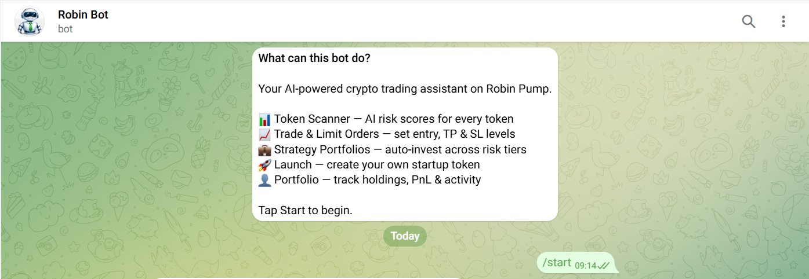
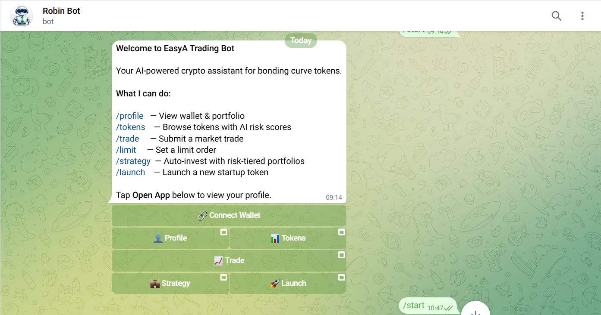
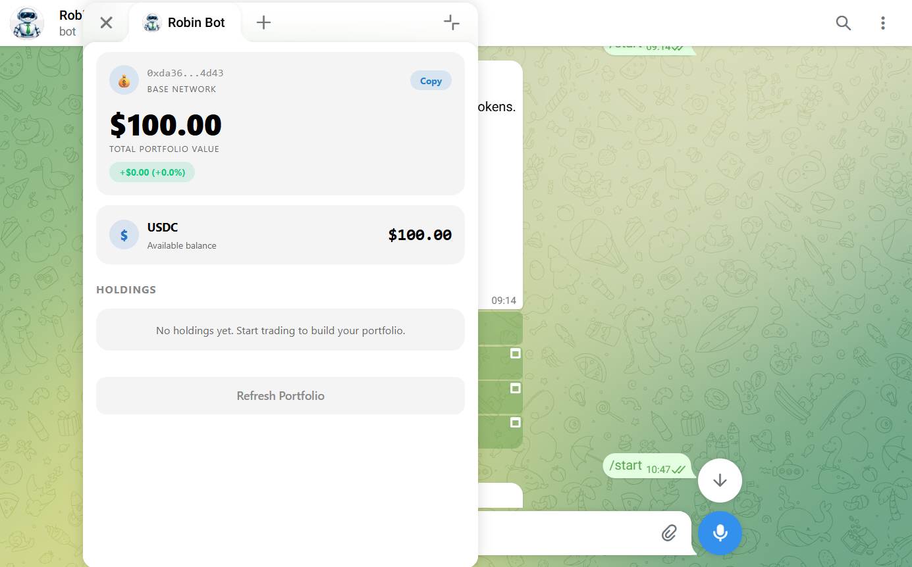
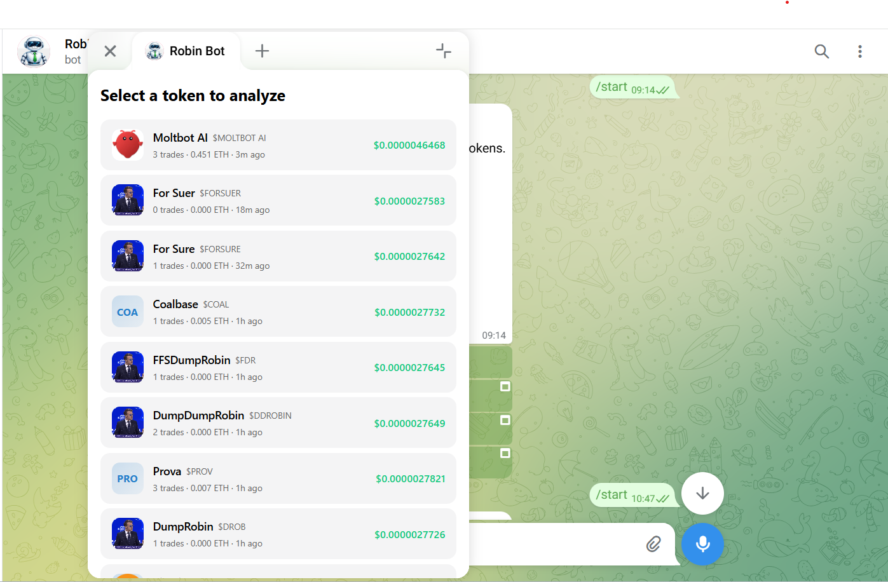
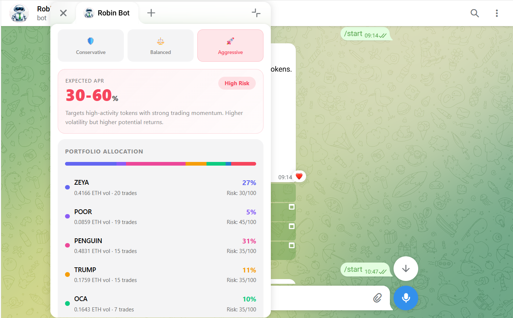

# RobinBot

AI-powered crypto trading platform built as a Telegram Mini App on Base. Browse bonding curve tokens with real-time risk analysis, execute trades with multi-level limit orders, auto-invest through strategy portfolios, and launch your own token — all without leaving Telegram.

## 🎥 Demo Video

[👉 Watch on Google Drive]([https://drive.google.com/file/d/FILE_ID/view](https://drive.google.com/file/d/1PioPTpPNKiFDpoxmY3Q51LHNeVSo17NW/view?usp=sharing))

    

---

## Architecture

```
┌─────────────────────────────────────────────────────────┐
│              Telegram Mini App (Frontend)                │
│   Pump | Analyze | Trade | Strategy | Launch | Profile  │
└────────────────────────┬────────────────────────────────┘
                         │
┌────────────────────────▼────────────────────────────────┐
│              Telegraf Bot (Webhook)                      │
│   /start /tokens /trade /strategy /launch /profile      │
└────────────────────────┬────────────────────────────────┘
                         │
┌────────────────────────▼────────────────────────────────┐
│              Next.js API Routes                         │
│   /analyze /portfolio /strategy /limit-order /launch    │
└───────┬────────────────┬───────────────┬────────────────┘
        │                │               │
┌───────▼──────┐ ┌───────▼──────┐ ┌──────▼───────┐
│   Goldsky    │ │   OpenAI     │ │   Pinata     │
│   Subgraph   │ │  GPT-4o-mini │ │ IPFS Gateway │
│  (on-chain)  │ │ (risk AI)    │ │ (metadata)   │
└───────┬──────┘ └──────────────┘ └──────────────┘
        │
┌───────▼──────────────────────────────────────────┐
│          Base L2 (Smart Contracts)               │
│   OpenZeppelin Upgradeable Proxies + Hardhat     │
└──────────────────────────────────────────────────┘
```

---

## How It Works: Blockchain Interaction

### On-Chain Data Pipeline

All token data flows from Base L2 smart contracts through a **Goldsky GraphQL subgraph** (`pump-charts/v2`) that indexes bonding curve events in real-time:

```
Base L2 Contracts → Goldsky Indexer → GraphQL Subgraph → Next.js API → Frontend
```

The subgraph exposes two core entities:

**Curves** (bonding curve tokens):
```graphql
{
  curves(first: 10, orderBy: createdAt, orderDirection: desc) {
    id createdAt token name symbol uri creator graduated
    lastPriceUsd lastPriceEth totalVolumeEth tradeCount lastTradeAt
  }
}
```

**Trades** (individual buy/sell events):
```graphql
{
  trades(where: { curve: $curveId }, orderBy: timestamp, orderDirection: desc) {
    id timestamp txHash trader side amountEth amountToken priceEth priceUsd
  }
}
```

Queries are routed through `lib/subgraph.ts` with automatic retry logic (3 attempts, exponential backoff) for reliability.

### Token Metadata (IPFS)

Each token stores a `uri` field pointing to IPFS metadata. The API resolves this server-side:

```
Token URI (ipfs://bafkrei...) → Pinata Gateway → { image, description } → API Response
```

This means the frontend receives pre-resolved HTTP image URLs — no client-side IPFS resolution needed.

### Smart Contracts

The contracts use **OpenZeppelin's TransparentUpgradeableProxy** pattern deployed on Base Sepolia:

| Contract | Purpose |
|----------|---------|
| `TransparentUpgradeableProxy.sol` | Upgradeable proxy allowing contract logic updates without changing the address |
| `ProxyAdmin.sol` | Admin controller (owner-only) that manages proxy upgrades |
| `ERC1967Proxy.sol` / `ERC1967Utils.sol` | ERC-1967 standard storage slots for proxy implementation addresses |
| `BeaconProxy.sol` / `UpgradeableBeacon.sol` | Beacon pattern allowing multiple proxies to share one implementation |
| `Ownable.sol` | Access control for admin-restricted functions |

**Deployed Configuration (Base Sepolia):**
- **betToken (MOCK_USDC):** `0x0565ea3C8b2700e0b35197dF0258eA3A177930B9`
- **rewardToken (CBA):** `0x9812E5fd8c1fFD85ea3e81723596c9025C80D171`
- **Treasury:** `0xeEB323B5ba1001453aeFf3f28623D8832A82e146`

---

## Risk Scoring Engine

`lib/risk.ts` implements a **multi-factor quantitative risk model** scoring tokens 0–100 (higher = riskier):

### Factor Breakdown

| Factor | Weight | Low Risk (0 pts) | Medium (5-10 pts) | High Risk (15-25 pts) |
|--------|--------|-------------------|--------------------|-----------------------|
| **Volume** | 0-25 | > 1 ETH | 0.1–1 ETH | < 0.1 ETH |
| **Trade Count** | 0-25 | > 20 trades | 5–20 trades | < 5 trades |
| **Age** | 0-20 | > 24 hours | 1–24 hours | < 1 hour |
| **Graduated** | -10 to +10 | Yes (-10 bonus) | — | No (+10) |
| **Last Trade** | 0-15 | < 24h ago | — | > 24h / Never |

### Risk Levels

| Score | Level | Emoji |
|-------|-------|-------|
| 0–30 | Low | 🟢 |
| 31–60 | Medium | 🟡 |
| 61–100 | High | 🔴 |

The composite score is passed to **GPT-4o-mini** along with trade data for a natural language risk assessment that produces a verdict: **SAFE**, **CAUTION**, or **AVOID**.

### AI Analysis Prompt Structure

```
Token metadata → Risk score + factors → Recent trade summary → GPT-4o-mini → Verdict
```

The AI receives:
- Token name, contract address, creator, creation date
- Price, volume, trade count, graduation status
- Last 30 trades: unique traders, buy/sell ratio, recent volume
- Pre-computed risk score and factor breakdown

---

## API Endpoints

| Endpoint | Method | Purpose |
|----------|--------|---------|
| `/api/analyze` | GET/POST | Fetches token data from subgraph, computes risk score, resolves IPFS metadata, runs GPT-4o-mini analysis. Returns `{ curve, risk, tradeSummary, analysis }` |
| `/api/portfolio` | GET/POST | Portfolio management: wallet balance, token holdings, PnL tracking, trade history |
| `/api/strategy` | GET | Generates risk-tiered allocations (conservative/balanced/aggressive) from live token data |
| `/api/limit-order` | GET/POST/DELETE | Multi-level limit order CRUD: entry price, take-profit, stop-loss triggers |
| `/api/launch` | GET/POST | Token creation: name, ticker, logo, description, social links, initial purchase |
| `/api/chart-data` | GET | Transforms trade history into time-series OHLCV data for Lightweight Charts |
| `/api/connect-wallet` | POST | Wallet connection via encrypted private key |
| `/api/telegram` | POST | Telegraf webhook: processes bot commands, inline keyboards, web app data |

### `/api/analyze` — Deep Dive

This is the core endpoint. It runs three operations in sequence:

1. **Parallel data fetch:** `fetchCurveById()` + `fetchTrades()` via Goldsky subgraph
2. **Risk computation:** `computeRiskScore()` evaluates 5 weighted factors
3. **IPFS metadata resolution:** Fetches token image & description from Pinata gateway
4. **AI analysis:** GPT-4o-mini generates natural language risk report
5. **Response:** Returns unified JSON with curve data, risk breakdown, trade summary, image URL, and AI analysis

---

## Telegram Bot

The bot (`pages/api/telegram.ts`) uses **Telegraf 4.16** in webhook mode with these commands:

| Command | Action |
|---------|--------|
| `/start` | Welcome message with inline keyboard buttons for all features |
| `/tokens` | Paginated token scanner (5 per page) with inline risk scores and analyze buttons |
| `/trade` | Opens trade mini-app; accepts `TOKEN AMOUNT SIDE` format in chat |
| `/limit` | Opens limit order mini-app |
| `/strategy` | Strategy tier selector (Conservative / Balanced / Aggressive) |
| `/launch` | Opens token launch mini-app |
| `/profile` | Portfolio view with wallet balance and holdings |
| `/pump` | Direct link to live coins browser |

**Data Flow:**
- Bot commands open Telegram Web App mini-apps embedded in the chat
- Mini-apps submit data back via `web_app_data` events
- Bot processes submissions (trades, orders, launches, strategies) and confirms

**Wallet Connection:**
User sends private key directly in chat → bot captures it, immediately deletes the message, and stores the encrypted key. All subsequent trades use this wallet.

---

## Project Structure

```
pages/
├── pump.tsx              # Live token listing (pump.fun-style grid)
├── analyze.tsx           # Token list → AI risk analysis detail view
├── limit-order.tsx       # Multi-level limit order builder
├── strategy.tsx          # Risk-tiered portfolio builder
├── launch.tsx            # Token launch form
├── profile.tsx           # Wallet, holdings, PnL, trade history
├── trade.tsx             # Market trade panel
├── connect-wallet.tsx    # Wallet connection flow
├── project/[id].tsx      # Dynamic project detail with trading chart
└── api/
    ├── telegram.ts       # Telegraf webhook handler
    ├── analyze.ts        # AI risk analysis endpoint
    ├── portfolio.ts      # Portfolio management
    ├── strategy.ts       # Strategy allocation engine
    ├── limit-order.ts    # Limit order management
    ├── launch.ts         # Token launch endpoint
    ├── chart-data.ts     # OHLCV chart data
    └── connect-wallet.ts # Wallet connection

lib/
├── subgraph.ts           # Goldsky GraphQL queries (retry logic)
├── risk.ts               # Composite risk scoring engine
└── chart-utils.ts        # Trade → chart data transformation

contracts/                # Hardhat project (Base Sepolia)
├── contracts/            # OpenZeppelin upgradeable proxies
├── ignition/             # Deployment modules
├── scripts/              # Deploy & admin scripts
└── test/                 # Contract tests

scripts/
└── set-webhook.ts        # Telegram bot webhook + commands setup
```

---

## Tech Stack

| Layer | Technology |
|-------|-----------|
| Framework | Next.js 16.1.6, React 19, TypeScript |
| Styling | Tailwind CSS 4, Telegram theme variables |
| Bot | Telegraf 4.16 (webhook mode) |
| On-chain data | Goldsky GraphQL subgraph (pump-charts/v2) |
| AI | OpenAI GPT-4o-mini |
| Charts | Lightweight Charts v4 |
| Smart contracts | Solidity, Hardhat, OpenZeppelin (upgradeable proxies) |
| IPFS | Pinata gateway |
| Network | Base L2 (Sepolia testnet) |

---

## Getting Started

### Prerequisites
- Node.js 18+
- Telegram bot token (from [@BotFather](https://t.me/BotFather))
- OpenAI API key
- Public HTTPS URL (ngrok for local dev)

### Setup

```bash
npm install
```

Create `.env.local`:

```env
BOT_TOKEN=your_telegram_bot_token
OPENAI_API_KEY=your_openai_key
NEXT_PUBLIC_APP_URL=https://your-domain.ngrok-free.app
```

### Configure the bot

```bash
npx tsx scripts/set-webhook.ts
```

This registers the webhook, sets bot commands, description, and the Mini App menu button.

### Run

```bash
npm run dev
```

### Build

```bash
npm run build && npm start
```

### Smart Contracts

```bash
cd contracts
npm install
npx hardhat compile
npx hardhat test
```

---

## License

MIT
